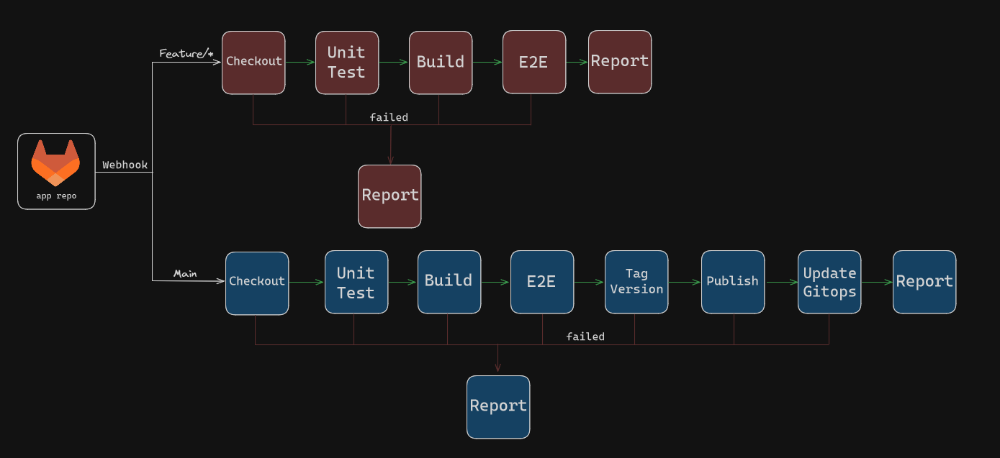

# Flask Application

This repository contains a Flask application designed to be run in Docker containers. The application is part of a CI/CD pipeline and includes a Jenkinsfile for automating the process of running end-to-end tests and publishing the application to Amazon Elastic Container Registry (ECR).

## Prerequisites

Before you begin, ensure you have the following installed on your machine:

- [Docker](https://www.docker.com/products/docker-desktop)
- [Docker Compose](https://docs.docker.com/compose/install/)

## Getting Started

Follow these steps to build and run the application using Docker:

### 1. Clone the Repository

```sh
git clone https://gitlab.com/shahaf4/flask-app
cd flask-app
```

### 2. Build the Docker Images

You need to build two Docker images: one for the Flask application and one for Nginx.
```sh
docker build -t flask-app:test -f Dockerfile .
docker build -t nginx:test -f Dockerfile-nginx .
```

### 3. Start the Application with Docker Compose

```sh
docker compose up
```

### 4. Access the Application

Once the containers are up and running, you can access the application in your web browser at `http://localhost:80`.

## CI/CD Pipeline

This repository includes a Jenkinsfile for automating the CI/CD pipeline. The pipeline performs the following steps:

1. **Runs** end-to-end tests.
2. **Builds** Docker images.
3. **Publishes** the images to Amazon ECR.
    

```markdown
## Repository Structure
flask-app/
├── Dockerfile              # Dockerfile for the Flask application
├── Dockerfile-nginx        # Dockerfile for the Nginx reverse proxy
├── Jenkinsfile             # Jenkins pipeline script
├── docker-compose.yml      # Docker Compose configuration file
├── app.py                  # Flask application file
├── requirements.txt        # Requirements file for the Flask application
├── nginx/                  # Directory containing the Nginx configuration
│ └── nginx.conf
├── static/                 # Directory containing the static files
│ └── index.html
├── tests/                  # Directory containing the end-to-end tests script
│ └── test.sh
└── README.md               # This README file
```

# Application Architecture


# Jenkins Pipeline


# Contact

###### If you have any questions or need further assistance, please feel free to contact me at shahafseg@gmail.com
