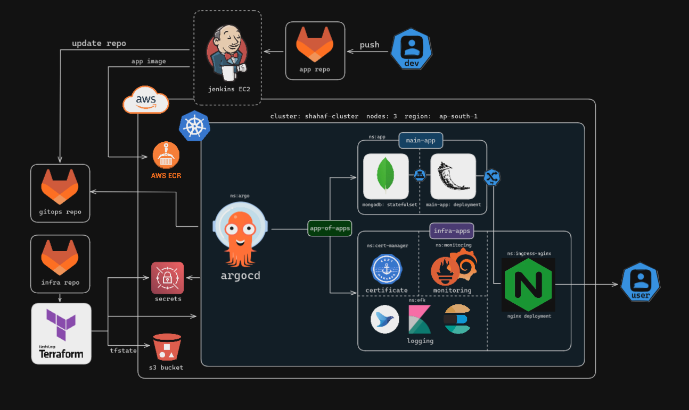
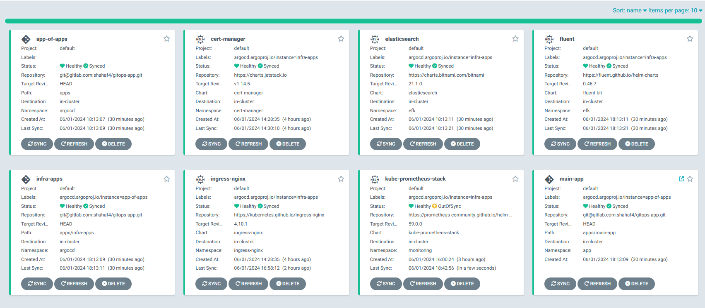

# GitOps Repository

This repository contains the infrastructure and application configurations for deploying resources using GitOps principles with ArgoCD. The repository is organized to facilitate the management and deployment of Kubernetes resources.

## Prerequisites

Before you begin, ensure you have the following installed on your machine:

- [ArgoCD](https://argo-cd.readthedocs.io/en/stable/getting_started/)
- [Helm](https://helm.sh/docs/intro/install/)

## Getting Started

Follow these steps to apply the argocd application:

### 1. Clone the Repository

```sh
git clone https://gitlab.com/shahaf4/gitops-app
cd gitops-app
```

### 2. Apply the ArgoCD Application

Create a file named app-of-apps.yaml and paste the above ArgoCD application manifest into it. Then apply it using kubectl:
```sh
apiVersion: argoproj.io/v1alpha1
kind: Application
metadata:
  name: app-of-apps
  namespace: argocd
spec:
  project: default
  source:
    repoURL: "git@gitlab.com:shahaf4/gitops-app.git"
    targetRevision: HEAD
    path: apps
  destination:
    server: "https://kubernetes.default.svc"
    namespace: argocd
  syncPolicy:
    automated:
      prune: true
      selfHeal: true
    syncOptions:
      - CreateNamespace=true
      - ServerSideApply=true
```


```markdown
## Repository Structure
gitops-repo/
├── README.md                      # This README file
└── apps                           # Directory containing application configurations
├── infra-apps                     # Infrastructure applications
│   ├── cert-manager.yaml          # Cert-Manager configuration
│   ├── elasticsearch.yaml         # Elasticsearch configuration
│   ├── files                      # Directory containing Helm values files
│   │   ├── elastic-values.yaml    # Elasticsearch values
│   │   ├── fluent-values.yaml     # Fluentd values
│   │   └── prom-values.yaml       # Prometheus values
│   ├── fluentd.yaml               # Fluentd configuration
│   ├── ingress-controller.yaml    # Ingress Controller configuration
│   └── kube-prometheus-stack.yaml # Kube Prometheus Stack configuration
├── infra-apps.yaml                # Aggregated infrastructure applications manifest
├── main-app                       # Main application directory
│   ├── Chart.lock                 # Helm chart lock file
│   ├── Chart.yaml                 # Helm chart definition
│   ├── charts                     # Helm charts directory
│   │   └── mongodb-15.3.0.tgz     # MongoDB chart
│   ├── templates                  # Kubernetes resource templates
│   │   ├── cluster-issuer.yaml    # ClusterIssuer resource template
│   │   ├── configmap.yaml         # ConfigMap resource template
│   │   ├── deployment.yaml        # Deployment resource template
│   │   ├── ingress-nginx.yaml     # Ingress resource template
│   │   └── service.yaml           # Service resource template
│   └── values.yaml                # Helm values file
└── main-app.yaml                  # Main application manifest
```

# Full Architecture


# Argocd


# Grafana dashboard


# Kibana dashboard


# Contact

###### If you have any questions or need further assistance, please feel free to contact me at shahafseg@gmail.com
